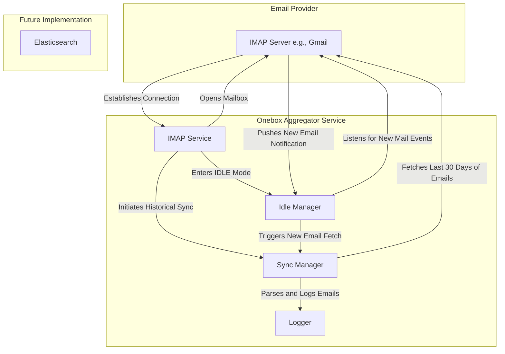

# Alokit_Onebox: Real-Time Email Synchronization Service

**Assignment for: Associate Backend Engineer @ ReachInbox**

---

## Overview

This project is a robust backend service designed to provide real-time, two-way synchronization with an email account using the IMAP protocol. It continuously listens for new emails, fetches historical messages, and is built to be scalable and resilient. This document covers the first functional requirement (FR-1), focusing on email synchronization.

---

## FR-1: Real-Time Email Synchronization

This is the core feature of the application, enabling seamless integration with any IMAP-based email server like Gmail.

### Key Features

-   **Secure IMAP Connection**: Establishes a secure and stable connection to the user's email server using `node-imap`.
-   **Historical Email Sync**: On initial startup, the service fetches all emails from the last 30 days to build a complete inbox view.
-   **Real-Time Email Detection**: Utilizes the **IMAP IDLE** command to listen for new emails in real-time, ensuring the application is updated within seconds of an email's arrival.
-   **Robust Error Handling & Reconnection**: Includes an automatic reconnection manager that attempts to re-establish a connection in case of network failures or timeouts, ensuring high availability.
-   **Safe Configuration**: Manages sensitive credentials securely using a `.env` file, which is excluded from version control via `.gitignore`.

### Architecture & Data Flow

The following diagram illustrates the flow of data from the IMAP server to the service.



---

## Tech Stack

-   **Backend**: Node.js
-   **Language**: TypeScript
-   **IMAP Communication**: `node-imap`
-   **Environment Management**: `dotenv`
-   **Logging**: `winston`
-   **Development**: `nodemon`, `ts-node`

---

## Setup and Installation

Follow these steps to get the project running on your local machine.

### Prerequisites

-   Node.js (v18 or higher)
-   npm

### 1. Clone the Repository

```bash
git clone https://github.com/ALOK-Yeager/Alokit_Onebox.git
cd onebox_aggregator
```

### 2. Install Dependencies

```bash
npm install
```

### 3. Configure Environment Variables

Create a `.env` file in the root of the project by copying the example file:

```bash
# For Windows (Command Prompt)
copy .env.example .env

# For Windows (PowerShell)
cp .env.example .env

# For macOS/Linux
cp .env.example .env
```

Now, open the `.env` file and fill in your IMAP server details.

```properties
# Your email provider's IMAP server (e.g., imap.gmail.com)
IMAP_SERVER=imap.gmail.com
IMAP_PORT=993

# Your email address and password
# IMPORTANT: For Gmail, you must generate an "App Password".
# See: https://support.google.com/accounts/answer/185833
IMAP_USER=your-email@example.com
IMAP_PASSWORD=your-app-password

# Enable TLS (recommended)
IMAP_TLS=true
```

---

## Running the Application

### Development Mode

To run the application with hot-reloading, use the `dev` script. This will automatically restart the server when you make changes to the code.

```bash
npm run dev
```

### Build for Production

To compile the TypeScript code into JavaScript, run the build command:

```bash
npm run build
```

The compiled output will be in the `dist/` directory.

### Running in Production

After building the project, you can run the compiled code directly with Node.js:

```bash
node dist/main.js
```

---

## FR-2: Searchable Storage with Elasticsearch

### Prerequisites for Elasticsearch Testing

1. **Elasticsearch Server**: Make sure Elasticsearch is running on your system.

```bash
# Using Docker (recommended)
docker run -p 9200:9200 -e "discovery.type=single-node" elasticsearch:8.11.0

# Or install locally and start the service
```

2. **Environment Setup**: Add Elasticsearch configuration to your `.env` file:

```bash
# Elasticsearch configuration
ELASTICSEARCH_NODE=http://localhost:9200
```

### Running Tests

#### 1. Check Setup
First, verify that all dependencies and Elasticsearch are properly configured:

```bash
npm run check-setup
```

This command will:
- ✅ Verify all required packages are installed
- 🔌 Test Elasticsearch connection
- 📝 Provide next steps based on the results

#### 2. Test Elasticsearch Integration
Run the comprehensive Elasticsearch test suite:

```bash
npm run test:elasticsearch
```

This test will:
- Initialize the Elasticsearch service
- Create a test email entry
- Index the email in Elasticsearch
- Test search functionality with various queries
- Verify filtered search capabilities

#### 3. Test API Endpoints
Test the Express.js API routes for email search:

```bash
npm run test:api
```

Then open your browser or use curl to test the API:

```bash
# Test search endpoint
curl "http://localhost:3001/api/emails/search?q=test&from=0&size=10"
```

### Expected Results

When tests pass successfully, you should see:
- ✅ Elasticsearch connection established
- ✅ Email indexing working
- ✅ Search queries returning results
- ✅ API endpoints responding correctly

### Troubleshooting

**Connection Failed**: 
- Ensure Elasticsearch is running on the specified port
- Check firewall settings
- Verify ELASTICSEARCH_NODE environment variable

**No Search Results**:
- Wait a few seconds for indexing to complete
- Check if test emails were properly indexed
- Verify index mapping in Elasticsearch

**API Errors**:
- Check server logs for detailed error messages
- Ensure all TypeScript files compile without errors
- Verify all required dependencies are installed

---

## FR-3: Ai-Based Email Categarization

*(This section will be updated upon completion of the second functional requirement.)*

