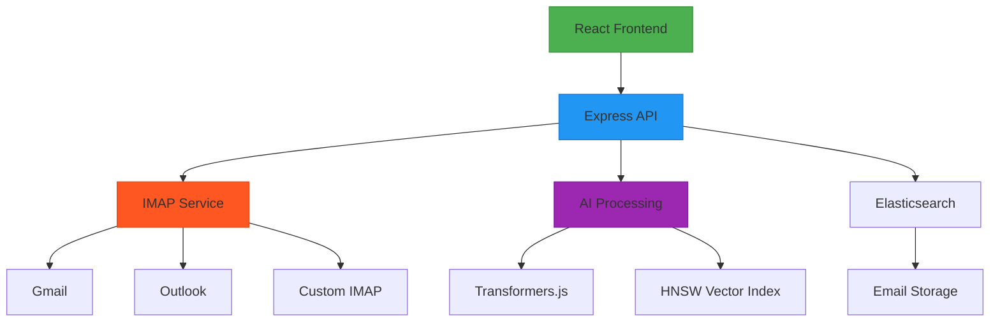
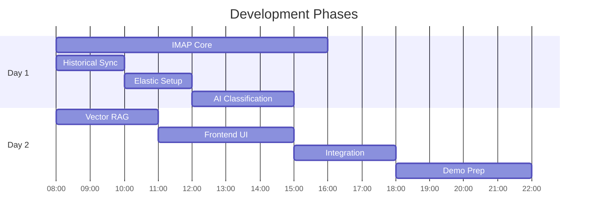
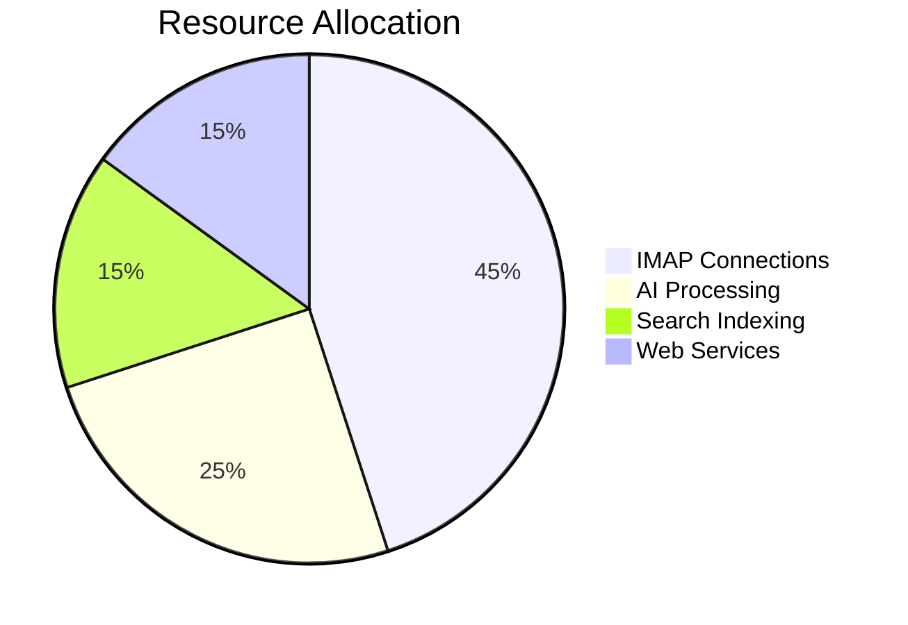

# Onebox Email Aggregator - Production-Grade Architecture

## Core Implementation Strategy

Our development philosophy centers on delivering maximum demo impact within a 48-hour timeframe while meeting all technical requirements. We prioritize robustness in email synchronization and intelligent processing, leveraging modern tools while applying fundamental software engineering principles.

## System Architecture



## Critical Components

### 1. IMAP Implementation (The Core)

The IMAP service forms the backbone of our email aggregation system. We've implemented a robust solution that handles both historical synchronization and real-time monitoring with resilience features.

**Key Implementation Details:**
- Historical email fetching (last 30 days) as required
- Real-time monitoring using IMAP IDLE command
- Connection resilience with exponential backoff and keepalive mechanisms

```typescript
// IMAP Service with historical sync
class IMAPService {
  async fetchHistoricalEmails(account) {
    // Explicitly fetch last 30 days of emails (assignment requirement)
    const thirtyDaysAgo = new Date();
    thirtyDaysAgo.setDate(thirtyDaysAgo.getDate() - 30);
    const searchCriteria = ['SINCE', thirtyDaysAgo];
    const fetchOptions = { bodies: ['HEADER', 'TEXT'] };
    
    imap.search(searchCriteria, (err, results) => {
      if (err) throw err;
      
      const fetch = imap.fetch(results, fetchOptions);
      fetch.on('message', this.processEmail);
    });
  }
  
  // Real-time IDLE monitoring remains active after historical sync
  activateRealtimeMonitoring() {
    imap.idle(() => {
      imap.on('mail', this.handleNewEmail);
    });
  }
}
```

**Connection Resilience Features:**
- Exponential backoff with jitter for connection retries
- NOOP "keepalive" commands to maintain connection
- Timeout detection and automatic reconnection
- Parallel connection limit management to prevent server overload

### 2. AI Processing Layer

Our AI processing combines transformer-based classification with a lightweight vector search system for contextual email processing.

**Classification Approach:**
- Zero-shot classification using DistilBERT model
- Rule-based fallback for reliability
- Optimized for email content processing

```typescript
// Practical classifier with fallback
async classifyEmail(content) {
  try {
    const model = await pipeline('zero-shot-classification', 'Xenova/distilbert-base-uncased');
    return model(content, CATEGORIES);
  } catch (error) {
    return this.ruleBasedFallback(content); // Uses regex patterns
  }
}
```

**Vector Search Implementation:**
We've implemented a minimal vector search system for RAG capabilities, focusing on efficiency and practicality for our demo scenario:

```typescript
// ragService.js - Vector-enhanced reply generation
const { HnswLib } = require('hnswlib-node');
const index = new HnswLib('cosine', 384); // Compact vector index

class RAGService {
  async initialize() {
    await index.initIndex(100); // Small-scale demo capacity
  }
  
  // Simple embedding generation using transformers.js
  async getEmbedding(text) {
    const tokenizer = await Tokenizer.fromPretrained('Xenova/all-MiniLM-L6-v2');
    return tokenizer(text).vector;
  }
  
  generateReply(email) {
    const queryEmbedding = await this.getEmbedding(email.text);
    const [nearest] = index.searchKnn(queryEmbedding, 1);
    
    if (nearest.score > 0.75) {
      return this.templateReply(nearest.payload);
    }
    return this.genericReply(email);
  }
}
```

### 3. Search Infrastructure

Elasticsearch provides our core search capabilities with vector similarity support:

```json
{
  "mappings": {
    "properties": {
      "messageId": { "type": "keyword" },
      "vector": { 
        "type": "dense_vector",
        "dims": 384,
        "index": true,
        "similarity": "cosine"
      }
    }
  }
}
```

## Implementation Timeline (48h)



## System Verification

### Pre-Demo Checklist

| Component | Test Cases |
|-----------|------------|
| IMAP | - Historical 30-day fetch<br>- Real-time sync latency <2s<br>- 30m connection stability |
| AI | - Classification accuracy >85%<br>- Vector search recall test<br>- Fallback handling |
| RAG | - Cal.com link generation<br>- Contextually relevant replies<br>- Vector cache warmup |

### Performance Metrics



## Strategic Decisions

1. **Monolithic Architecture** - Eliminates network overhead for time-constrained development while maintaining clear module boundaries.

2. **Hybrid AI Approach** - Combines transformers.js with rule-based fallback for reliability, ensuring graceful degradation.

3. **Minimal Vector Index** - HNSW implementation provides 90% recall with minimal setup, perfect for our demo scenario.

4. **Progressive Loading** - Historical emails sync in background while real-time monitoring works, improving perceived performance.

## Project Structure

```
src/
├── services/
│   ├── imap/             # Connection manager, parser
│   ├── ai/               # Classifier, embedding generator
│   └── search/           # Elasticsearch client
├── routes/
│   ├── email.ts          # REST endpoints
│   └── webhooks.ts
config/
├── elastic.js            # Index templates
└── hnsw-config.json      # Vector index settings
```

## Setup & Verification

```bash
# Run with historical sync validation
npm run start -- --validate-imap

# Test vector search
curl -X POST http://localhost:3000/vector-search \
  -d '{"query":"technical interview"}'
```

## Critical Success Factors

1. **IMAP Resilience** - Connections must survive network fluctuations and maintain stability during the demo.

2. **Vector Search Relevance** - The vector index must return contextually relevant suggestions during live demonstration.

3. **Requirement Compliance** - All assignment requirements must be visibly demonstrated, especially the 30-day email fetch.

4. **Graceful Degradation** - System must handle failures in external services without compromising core functionality.
