# Onebox Email Aggregator – Demo-Ready Architecture

*Designed and implemented through hands-on development with AI assistance—focused squarely on delivering a working 36-hour proof-of-concept that nails the core assignment features.*

---

## Core Strategy

- **Focus:** Complete, demo-ready features over “production-grade” extras  
- **Must-have:**  
  1. **Persistent IMAP** (30-day backfill + resilient IDLE)  
  2. **Cal.com reply templates** (shortlist/interview logic)  
  3. **Basic search** (Elasticsearch storage + retrieval)  

---

## System Architecture

```mermaid
graph TD
  A[React Frontend] --> B[Express API]
  B --> C[IMAP Service]
  B --> D[AI + Templates]
  B --> E[Elasticsearch]
  C --> F[Gmail]
  C --> G[Outlook]
  C --> H[Custom IMAP]
  D --> I[Zero-Shot Classifier]
  D --> J[Cal.com Template RAG]
  E --> K[Email Storage]

  style A fill:#4CAF50,stroke:#388E3C
  style B fill:#2196F3,stroke:#1976D2
  style C fill:#FF5722,stroke:#E64A19
  style D fill:#9C27B0,stroke:#7B1FA2
````

---

## 1. IMAP Service – Resilience & 30-Day Backfill

* **Batch processing** to fetch large volumes safely
* **Command queue** to avoid breaking IDLE mode
* **Exponential backoff + jitter** on reconnects
* **NOOP keepalive** every 4 minutes

```typescript
// src/services/imap/imapService.ts

import Imap from 'imap';
import { simpleParser } from 'mailparser';

export class IMAPService {
  private imap: Imap;
  private commandQueue: Array<() => Promise<void>> = [];
  private isIdling = false;
  private reconnectAttempts = 0;

  constructor(config) {
    this.imap = new Imap(config);
    this.setupHandlers();
  }

  private setupHandlers() {
    this.imap.once('ready', () => {
      this.fetchHistoricalEmails();
      this.startIdleMode();
    });
    this.imap.on('error', () => this.scheduleReconnect());
    this.imap.on('end', () => this.scheduleReconnect());
  }

  // 30-day backfill (assignment requirement)
  async fetchHistoricalEmails() {
    const since = new Date();
    since.setDate(since.getDate() - 30);
    const criteria = ['SINCE', since];
    const options = { bodies: ['HEADER', 'TEXT'], markSeen: false };

    this.imap.search(criteria, (err, uids) => {
      if (err) throw err;
      const CHUNK = 200; // batch size
      for (let i = 0; i < uids.length; i += CHUNK) {
        const batch = uids.slice(i, i + CHUNK);
        this.queueCommand(() => this.fetchBatch(batch, options));
      }
      this.processQueue();
    });
  }

  private fetchBatch(uids, options) {
    return new Promise<void>((resolve, reject) => {
      const f = this.imap.fetch(uids, options);
      f.on('message', msg => this.processMessage(msg));
      f.once('end', () => resolve());
      f.once('error', reject);
    });
  }

  private processMessage(msg) {
    msg.on('body', async stream => {
      const parsed = await simpleParser(stream);
      // → save to Elasticsearch/db
    });
  }

  private startIdleMode() {
    this.imap.idle(() => {
      this.isIdling = true;
      // schedule NOOP
      setTimeout(() => this.sendNoop(), 4 * 60 * 1000);
    });
    this.imap.on('mail', () => this.queueCommand(() => this.fetchNewEmails()));
  }

  private async fetchNewEmails() {
    // fetch only unseen messages…
  }

  private sendNoop() {
    if (this.isIdling) {
      this.imap.noop();
      // reschedule
      setTimeout(() => this.sendNoop(), 4 * 60 * 1000);
    }
  }

  private queueCommand(cmd: () => Promise<void>) {
    this.commandQueue.push(cmd);
  }

  private async processQueue() {
    if (this.isIdling) {
      this.imap.idleDone();
      this.isIdling = false;
    }
    while (this.commandQueue.length) {
      const cmd = this.commandQueue.shift();
      await cmd();
    }
    this.startIdleMode();
  }
 private async processQueue() { … }

  // ─── Memory Leak Prevention (insert here) ───
  private cleanupListeners() {
    this.imap.removeAllListeners('ready');
    this.imap.removeAllListeners('error');
    this.imap.removeAllListeners('end');
    this.imap.removeAllListeners('mail');
    this.imap.removeAllListeners('idle');
  }
  // ────────────────────────────────────────────
  private scheduleReconnect() {
    const delay = Math.min(1000 * 2 ** this.reconnectAttempts + Math.random() * 1000, 30000);
    this.reconnectAttempts++;
    setTimeout(() => this.imap.connect(), delay);
  }

  connect() {
    this.imap.connect();
  }
}
```

---

## 2. AI + Templates – Zero-Shot + Cal.com Links

* **Zero-shot classifier** for general categorization
* **Template-based RAG** for “shortlisted/interview” logic (2 hr max)

```typescript
// src/services/ai/templateRag.ts

export class TemplateRAG {
  generateReply(subject: string, body: string): string {
    const calLink = process.env.CAL_COM_LINK;
    const text = (subject + ' ' + body).toLowerCase();

    if (text.includes('shortlist') || text.includes('interview')) {
      return `Thank you for shortlisting my profile!  
You can schedule a technical interview here: ${calLink}`;
    }

    if (text.includes('meeting') || text.includes('calendar')) {
      return `Happy to set up a meeting. Please pick a slot: ${calLink}`;
    }

    return `Thanks for reaching out about "${subject}". I'll review and get back shortly.`;
  }
}
```

---

## 3. Search (Elasticsearch)

```json
// config/elastic.json
{
  "mappings": {
    "properties": {
      "messageId": { "type": "keyword" },
      "from":      { "type": "keyword" },
      "to":        { "type": "keyword" },
      "subject":   { "type": "text" },
      "date":      { "type": "date" },
      "body":      { "type": "text" }
    }
  }
}
```

---

## Revised Timeline

```mermaid
gantt
  title 36-Hour Demo Schedule
  dateFormat  HH:mm
  axisFormat  %H:%M

  section Day 1
    IMAP Resilience & Backfill  :08:00, 15h
    Elasticsearch Setup         :23:00, 2h

  section Day 2
    Zero-Shot Classifier        :07:00, 3h
    Template RAG                :10:00, 2h
    Frontend + Integration      :12:00, 6h
    Testing & Demo Prep         :18:00, 4h
```



---

## Pre-Demo Checklist

* **IMAP:** Survives 30+ minutes, auto-reconnects, IDLE intact
* **Templates:** “shortlisted” test email → Cal.com link
* **Search:** Basic email queries return correct hits

---

## Explicit Cal.com Test

```bash
# Test: “shortlisted” in body
curl -X POST http://localhost:3000/reply \
  -H "Content-Type: application/json" \
  -d '{"subject":"Congrats","body":"I have been shortlisted"}'
# Expect: contains your CAL_COM_LINK
```

---

## Enhancements & Focus

1. **Full IMAP resilience** (batching, queueing, jitter, keepalive)
2. **Simplified RAG** to meet the Cal.com requirement in 1–2 hours

*This architecture document prioritizes working features—exactly what the demo judges will look for.*


